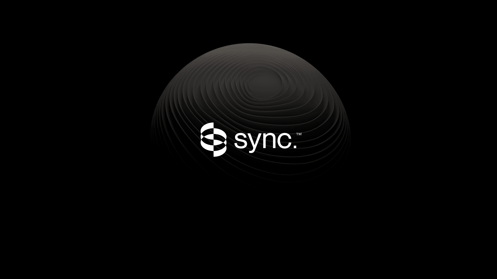

<div align="center">

[](https://synclabs.so)

# [Sync. labs](https://synclabs.so)

Synchronize API allows you to lipsync a video to any audio in any language.

</div>

## Requirements

Building the API client library requires:

1. Java 1.8+
2. Maven (3.8.3+)/Gradle (7.2+)

If you are adding this library to an Android Application or Library:

3. Android 8.0+ (API Level 26+)

## Installation<a id="installation"></a>
<div align="center">
  <a href="https://konfigthis.com/sdk-sign-up?company=sync.%20labs&language=Java">
    
  </a>
</div>

### Maven users

Add this dependency to your project's POM:

```xml
<dependency>
  <groupId>com.konfigthis</groupId>
  <artifactId>sync-labs-java-sdk</artifactId>
  <version>1.0</version>
  <scope>compile</scope>
</dependency>
```

### Gradle users

Add this dependency to your `build.gradle`:

```groovy
// build.gradle
repositories {
  mavenCentral()
}

dependencies {
   implementation "com.konfigthis:sync-labs-java-sdk:1.0"
}
```

### Android users

Make sure your `build.gradle` file as a `minSdk` version of at least 26:
```groovy
// build.gradle
android {
    defaultConfig {
        minSdk 26
    }
}
```

Also make sure your library or application has internet permissions in your `AndroidManifest.xml`:

```xml
<!--AndroidManifest.xml-->
<?xml version="1.0" encoding="utf-8"?>
<manifest xmlns:android="http://schemas.android.com/apk/res/android"
    xmlns:tools="http://schemas.android.com/tools">
    <uses-permission android:name="android.permission.INTERNET"/>
</manifest>
```

### Others

At first generate the JAR by executing:

```shell
mvn clean package
```

Then manually install the following JARs:

* `target/sync-labs-java-sdk-1.0.jar`
* `target/lib/*.jar`

## Getting Started

Please follow the [installation](#installation) instruction and execute the following Java code:

```java
import com.konfigthis.client.ApiClient;
import com.konfigthis.client.ApiException;
import com.konfigthis.client.ApiResponse;
import com.konfigthis.client.SyncLabs;
import com.konfigthis.client.Configuration;
import com.konfigthis.client.auth.*;
import com.konfigthis.client.model.*;
import com.konfigthis.client.api.AnimateApi;
import java.util.List;
import java.util.Map;
import java.util.UUID;

public class Example {
  public static void main(String[] args) {
    Configuration configuration = new Configuration();
    configuration.host = "https://api.synclabs.so";
    
    configuration.apiKey  = "YOUR API KEY";
    SyncLabs client = new SyncLabs(configuration);
    String videoUrl = "videoUrl_example"; // A url to the video file to be synchronized -- must be publicly accessible
    String transcript = "transcript_example"; // A string of text to be spoken by the AI
    String voiceId = "voiceId_example"; // The voice to use for audio generation
    String model = "sync-1.5.0"; // The model to use for video generation
    Double maxCredits = 3.4D; // Maximum number of credits to use for audio generation. If job exceeds this value, the job will be aborted
    String webhookUrl = "webhookUrl_example"; // A url to send a notification to upon completion of audio generation
    try {
      AnimateInitial result = client
              .animate
              .animate(videoUrl, transcript, voiceId)
              .model(model)
              .maxCredits(maxCredits)
              .webhookUrl(webhookUrl)
              .execute();
      System.out.println(result);
      System.out.println(result.getId());
      System.out.println(result.getVideoUrl());
      System.out.println(result.getAudioUrl());
      System.out.println(result.getTranscriptUrl());
      System.out.println(result.getStatus());
    } catch (ApiException e) {
      System.err.println("Exception when calling AnimateApi#animate");
      System.err.println("Status code: " + e.getStatusCode());
      System.err.println("Reason: " + e.getResponseBody());
      System.err.println("Response headers: " + e.getResponseHeaders());
      e.printStackTrace();
    }

    // Use .executeWithHttpInfo() to retrieve HTTP Status Code, Headers and Request
    try {
      ApiResponse<AnimateInitial> response = client
              .animate
              .animate(videoUrl, transcript, voiceId)
              .model(model)
              .maxCredits(maxCredits)
              .webhookUrl(webhookUrl)
              .executeWithHttpInfo();
      System.out.println(response.getResponseBody());
      System.out.println(response.getResponseHeaders());
      System.out.println(response.getStatusCode());
      System.out.println(response.getRoundTripTime());
      System.out.println(response.getRequest());
    } catch (ApiException e) {
      System.err.println("Exception when calling AnimateApi#animate");
      System.err.println("Status code: " + e.getStatusCode());
      System.err.println("Reason: " + e.getResponseBody());
      System.err.println("Response headers: " + e.getResponseHeaders());
      e.printStackTrace();
    }
  }
}

```

## Documentation for API Endpoints

All URIs are relative to *https://api.synclabs.so*

Class | Method | HTTP request | Description
------------ | ------------- | ------------- | -------------
*AnimateApi* | [**animate**](docs/AnimateApi.md#animate) | **POST** /animate | 
*AnimateApi* | [**animateCost**](docs/AnimateApi.md#animateCost) | **GET** /animate/cost | 
*AnimateApi* | [**getAnimation**](docs/AnimateApi.md#getAnimation) | **GET** /animate/{id} | 
*LipsyncApi* | [**getLipsync**](docs/LipsyncApi.md#getLipsync) | **GET** /lipsync/{id} | 
*LipsyncApi* | [**lipSync**](docs/LipsyncApi.md#lipSync) | **POST** /lipsync | 
*LipsyncApi* | [**lipsyncCost**](docs/LipsyncApi.md#lipsyncCost) | **GET** /lipsync/cost | 
*SpeakApi* | [**getSpeech**](docs/SpeakApi.md#getSpeech) | **GET** /speak/{id} | 
*SpeakApi* | [**speak**](docs/SpeakApi.md#speak) | **POST** /speak | 
*SpeakApi* | [**speakCost**](docs/SpeakApi.md#speakCost) | **GET** /speak/cost | 
*TranslateApi* | [**getTranslation**](docs/TranslateApi.md#getTranslation) | **GET** /translate/{id} | 
*TranslateApi* | [**translate**](docs/TranslateApi.md#translate) | **POST** /translate | 
*TranslateApi* | [**translationCost**](docs/TranslateApi.md#translationCost) | **GET** /translate/cost | 
*VideoApi* | [**cost**](docs/VideoApi.md#cost) | **GET** /video/cost | 
*VideoApi* | [**getLipSyncJob**](docs/VideoApi.md#getLipSyncJob) | **GET** /video/{id} | 
*VideoApi* | [**lipSync**](docs/VideoApi.md#lipSync) | **POST** /video | 
*VoicesApi* | [**voices**](docs/VoicesApi.md#voices) | **GET** /voices | 


## Documentation for Models

 - [AnimateDto](docs/AnimateDto.md)
 - [AnimateExtended](docs/AnimateExtended.md)
 - [AnimateInitial](docs/AnimateInitial.md)
 - [CreateVideoDto](docs/CreateVideoDto.md)
 - [LipSyncExtended](docs/LipSyncExtended.md)
 - [LipSyncInitial](docs/LipSyncInitial.md)
 - [LipsyncDto](docs/LipsyncDto.md)
 - [SpeakDto](docs/SpeakDto.md)
 - [SpeakExtended](docs/SpeakExtended.md)
 - [SpeakInitial](docs/SpeakInitial.md)
 - [TranslateDto](docs/TranslateDto.md)
 - [TranslationJobExtended](docs/TranslationJobExtended.md)
 - [TranslationJobInitial](docs/TranslationJobInitial.md)
 - [VideoExtended](docs/VideoExtended.md)
 - [VideoInitial](docs/VideoInitial.md)


## Author
This Java package is automatically generated by [Konfig](https://konfigthis.com)
